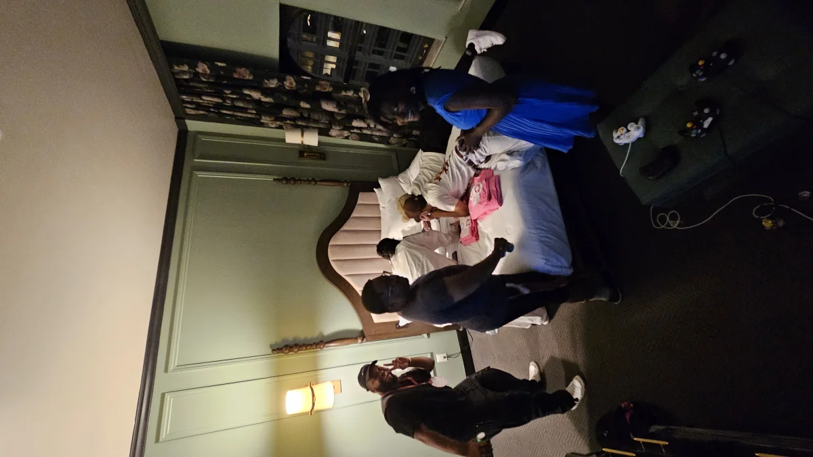
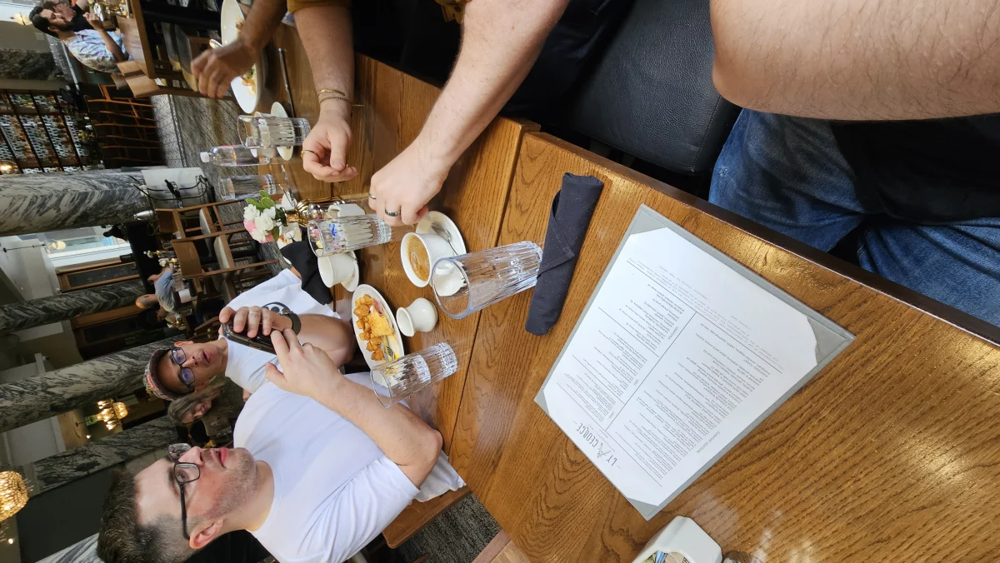
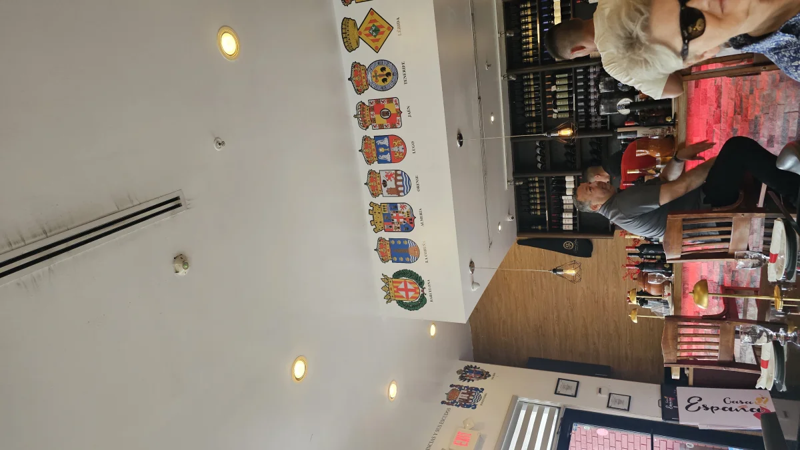

> _If you're mentioned or shown in this article and would like to be removed, send me a message over at [@nstlopez](https://x.com/nstlopez)_

So I just spent almost two months traveling across the US, hitting conferences, meeting customers, and somehow managing to live-debug production code mid-pitch. Let me take you through this _absolutely wild_ journey that started with a customs interrogation and ended with me shooting guns in Texas for the first time.

## Atlanta: The Great Luggage Swap & RenderATL

### Day 1: Welcome to America lmao

Left Madrid, landed in Atlanta. Got through customs clean, then _plot twist_, got stopped halfway out. They put me in a room for 30 minutes. Asked what happened and they told me "we can't tell you, goodbye". **Welcome to America**, I guess?

My boss [Zack Chapple](https://x.com/Zackary_Chapple) picked me up and immediately took me to **Costco**. Yes, _Costco_. First stop in America. Bought some pecans that made it all the way back to Spain (they were incredible, btw). After Chinese food and meeting his wonderful family, we headed downstairs to unpack.

Here's where it gets _hilarious_: **IT WASN'T MY LUGGAGE**. Same exact suitcase, shape, color, everything, but someone else's entire life inside. And apparently, the one I accidentally grabbed was a _rush order_ (urgent baggage). Whoops. We hustled back to the airport at midnight, apologized profusely, got mine back. Crisis averted.

### Day 2-4: RenderATL Madness

Next day we also picked up a shiny new **Apple M4 Max**. Sweet.

Day two kicked off in properly American fashion: **Wendy's Breakfast Baconator**.

Then straight to RenderATL where I finally met my coworkers [Shane](https://x.com/swalker326), [Lois](https://x.com/zmzlois), and [Sika](https://www.linkedin.com/in/sika-noxolo-24070017/) in person. Also [Xavier](https://x.com/Zaeboi222) and [Ptah](https://x.com/ptahdunbar) from Southern Glazer's, and [Joannier](https://www.linkedin.com/in/joannier-pinales/) from Microsoft.

First day was mostly networking, but I got to meet [Luca Mezzalira](https://x.com/lucamezzalira), _the_ microfrontends guy. We hit up the Makeswift and BigCommerce booth and met [Sani Yusuf](https://x.com/saniyusuf), who randomly knew Zephyr from way back.

Day two was an absolute blast. Went around all the booths meeting with the Cloudflare, Google, Vercel, Netlify, and Figma people. All super nice!

The speakers' dinner was where things got _interesting_:

> Me getting drunk at the dinner lmao

- Met [Eric Wendel](https://x.com/ericwendel_) (we'd met before in Madrid but neither of us remembered, classic)
- Finally met my long-time friend [Chris (TrashDev)](https://x.com/trashh_dev) from Netflix in person
- [Francesco Ciulla](https://x.com/FrancescoCiull4) and I geeked out about Rust and the dynamic tree-shaking stuff we're cooking at Zephyr

- [J Chris Anderson](https://x.com/jchris) from [Vibes.diy](https://vibes.diy/) blew my mind by creating and deploying apps _from his phone_ on the spot

After-party queue was insane, wrapping around the building. Shane, Chris, Lois, and I said "screw it" and went for a walk instead. Shane spots some guy and goes: _"Dude, that's a fucking actor."_

**IT WAS [MICHAEL PEÑA](https://en.wikipedia.org/wiki/Michael_Pe%C3%B1a)** from The Martian and Shooter. Got a pic and everything.

We ended up at a Japanese place for ramen, then stumbled into a hotel room party hosted by [Ryan Furrer](https://x.com/ryandotfurrer) and [Chris Nowicki](https://x.com/iamwix). Free drinks, great conversations, perfect night.

### The Cloudflare Incident™

Day three at Render was _comedy gold_. While working from our coworking space with Xavier, Luca, Zack, and Joannier, **Cloudflare had a massive outage**. Watching Luca and Joannier frantically checking internal Amazon and Microsoft channels to see if it was global was hilarious.

Back at the conference, _everyone_ crowded around the Cloudflare booth demanding answers. Then we found out it was actually **GCP's fault**, so the entire mob migrated to Google's booth. I've never seen anything like it.

Met the absolute legend [Ken Wheeler](https://x.com/ken_wheeler) at the Netlify booth. Most charismatic person I've ever met, hands down. Caught Zack Chapple's microfrontends talk (really solid), then tried **bison meat** for the first time at dinner while Ken entertained everyone with his stories.

Last RenderATL day: early demos with [Miguel](https://x.com/ollermi) from Makeswift and [Ali Tas](https://www.linkedin.com/in/alitas-dev/) from PayPal about Zephyr.

First-ever **Waffle House** experience (another American checkbox ✓).

Caught talks from Xavier and Lois.

Later that night, I hit another party where I met tons of people including [Roy Tan](https://www.linkedin.com/in/roytanjx/), [Sterling Chapman](https://www.linkedin.com/in/sterlingchapman/), [Shashi Lo](https://x.com/shashiwhocodes), [Dillon Goetz](https://bsky.app/profile/dgoetzcodes.bsky.social), and [Ethan Arrowood](https://x.com/ArrowoodTech). Stayed until past midnight just talking tech and life.

Bonus Atlanta day: breakfast with Chris and friends including [TypeSafeUI](https://x.com/typesafeui) and [Max Kless](https://x.com/MaxKless) from Nx. Later, Max, Lois, and I hung out with [Altan Stalker](https://x.com/StalkAltan), another Nx engineer, exploring Atlanta.

## Miami: Gators, Cuban Food, and Southern Glazer's

### First Day in Florida

Flight to Miami. Amazing Uber driver gave me life advice the whole ride. King, if you're reading this, you rock.

Pulled up to my hotel and there's a **fucking alligator** just chilling at the entrance. _Of course_ there is. Welcome to Florida. We all stood around for 15 minutes until animal control relocated it. Sad I didn't get any pictures.

The Cuban food and juice shops in Miami? _Incredible_. I'm still dreaming about those fresh juices.

### SGWS Office Week

First day at Southern Glazer's offices: sat with [Javier Oropesa](https://www.linkedin.com/in/javieroropesa/) diagramming Zephyr architecture and explaining our infrastructure implementation in detail. Later met [Jeff](https://www.linkedin.com/in/jeffandvik/) to discuss Module Federation specifics.

That evening, finally met coworker [Kelly Hull](https://www.linkedin.com/in/kellyhull/) in person. Dinner at a Cuban place nearby.

Day two brought the whole crew: Zack arrived along with Xavier and Ptah. Argentinian steakhouse for lunch (amazing meat).

Then my **first Chinese hot pot** that night. Loved it so much I ended up having hot pot in multiple cities after this.

We left with the Hard Rock Hotel lighting up the entire Miami sky behind us.

Spent the next days deep in planning: Zephyr + SGWS architecture, CDN optimization, infrastructure decisions. Met [Hrayr Mirzoyan](https://www.linkedin.com/in/hrayr-mirzoyan/), one of their architects who became an instant friend.

[Jordan Powell](https://x.com/JordanPowell88) from Nx joined us and we improved their CI times with Nx caching. Always satisfying watching those build times drop. Wrapped the week clearing knowledge silos and making sure everyone understood Zephyr's full capabilities.

Kelly and I found a Spanish restaurant one night that had all the provincial shields of Spain on the walls. Nice touch for a homesick Spaniard.

Weekend in Brickell: changed hotels, walked around Miami, did touristy stuff, bought clothes in the crazy heat. Massive thanks to Hrayr who took an entire day to show me around Miami: beaches, neighborhoods, the whole Miami lifestyle. You're the best, man.

## New York: Vercel Ship & Everything Else

### Empire State Views to Spotify Offices

First stop: offices with a _perfect_ Empire State view. Ended up talking about **Ember.js** (throwback!) and speedran [a plugin to make it deployable to Zephyr](https://github.com/ZephyrCloudIO/zephyr-examples/tree/main/examples/ember-vite). Still got it.

Spotify offices at the World Trade Center. Gorgeous views, amazing space. Had great conversations with [Ilya Lyamkin](https://x.com/ilyamkin) from the Backstage.io team.

Hit a Callstack React Native meetup where I met CEO [Kris Lis](https://x.com/foxthecoach) and cofounder [Mike Grabowski](https://x.com/grabbou), amongst other people from Callstack. Super nice people, great energy.

### Vercel Ship

**Vercel Ship 2025** was an absolute _vibe_. They know how to throw a conference. Met up with my friend [Javi](https://x.com/javivelasco) (who I knew from before), and also met [Guillermo](https://x.com/rauchg) and [Malte](https://x.com/malteubl). Got this cool pin with an NFC tag that I still carry around.

Worked from a coworking spot with [Yagiz](https://x.com/yagiznizipli) from Cloudflare, addressing some infrastructure questions we had.

Later I hit a LightningAI meetup and rooftop drinks where I met [Jorge Sancha from Tinybird](https://x.com/jorgesancha), one of the few Spanish startups killing it internationally.

Rest of NYC was pure tourism. Hit all the spots, ate all the food, walked until my feet hurt.

## Seattle: Module Federation Deep Dives & July 4th

Landed in Seattle and immediately met up with [Zack Jackson](https://x.com/ScriptedAlchemy), creator of Module Federation and infra architect at ByteDance. We spent _days_ together going deep on everything: distributed backends, JavaScript engines, and this wild idea about superpositioned infrastructure technology with Web3/blockchain elements. I'll write about that separately because it deserves its own post.

Quick visit to ByteDance offices, tourism around Seattle, and then **July 4th at Gas Works Park** watching fireworks. Pretty epic way to experience American Independence Day.

### The Tweet-Worthy Moment

The next week, while visiting a customer, I was mid-pitch demonstrating Zephyr when I spotted an issue in their docs. The customer challenged me directly: "If Zephyr is that fast and good, prove it. Show us." So I did. Without missing a beat, I found the issue, patched it IN PROD, and kept going with the demo.

[Zack tweeted about it](https://x.com/ScriptedAlchemy/status/1943557725889188123)

The longest part was that I'd never used that codebase before and had to find the problem. The patch was live before the commit hook even finished. Sometimes you just gotta ship.

Also took a stroll through the Microsoft campus, saw all the Minecraft stuff in the offices. Really cool to see where the magic happens.

## San Francisco: The Gang's All Here

Quick office tours, then met our interns at True Ventures: shoutout to [Nitin](https://x.com/nitinkanchi), [James](https://www.linkedin.com/in/james-duong-261242225/), and [Miles](https://www.linkedin.com/in/miles-kennedy-4162352a3/). You guys rock!

[Cluely](https://cluely.com/) offices were absolutely stunning. Loved the vibe and energy there with [Roy Lee](https://x.com/im_roy_lee) and the team.

At Cloudflare SF, got my photo with the **iconic lava lamp wall** (bucket list ✓) and talked more infrastructure.

Later, met [Gary Qi](https://x.com/gary_qz) from the Trae team back at True Ventures. Super chill guy.

### An Evening at Theo's

The night at [Theo's](https://x.com/t3dotgg) place was a _"meet your heroes"_ kind of evening. Theo was super friendly and taught us a crazy amount of information about content creation and cameras. I enjoyed every last bit of it.

Also met [Mark](https://x.com/r_marked) in person finally, we only talked a couple of times over Discord. Caught up with [Ben](https://x.com/bmdavis419) (we'd met before but neither could remember from where LOL). Chatted with [Amber](https://x.com/whosamberella) from Trae and [@itseieio](https://x.com/itseieio), creator of [onemillioncheckboxes.com](https://onemillioncheckboxes.com). Big fan btw.

## Austin: The Final Stop

Left SF at around 4 AM super sleep deprived even though we had slept a couple hours. Landed in Austin at 1 AM (love those late flights). Next day, straight to Cloudflare's Austin office to work and randomly bumped into friends who happened to be there.

Met [Dane](https://x.com/dok2001), Cloudflare's CTO and had some really exciting conversations about infrastructure and future possibilities. Super nice guy. It just so happens that the Makeswift team was there at the same exact time so we spent some time with them too.

Also met with my long time friend [Josh](https://x.com/0ximjosh) from Manifold Labs. He took me for lunch to a really cool place. Cheers mate.

Before flying home, I went to a shooting range for the first time in my life. Adrenaline rush like nothing else. Very Texas way to end a very American trip.

---

Thanks to everyone who shared their time, knowledge, food, and last-minute party access. The tech community is incredible, and meeting so many online friends IRL was surreal. 

Special thanks to [Zephyr](https://zephyr-cloud.io) for making this entire adventure possible. Without this amazing opportunity, none of these stories would exist. Grateful to work for a company that believes in building relationships and experiencing the world firsthand.

Until next time! 🚀

_P.S. - Still thinking about those Miami juice shops and that first hot pot experience. Some things just hit different when you're 5,000 miles from home._
