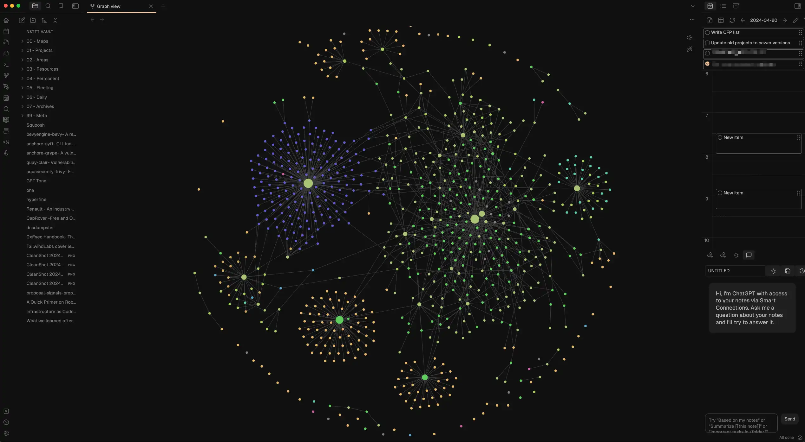

Obsidian has changed my workflow dramatically over the past year, I'm going to share with you today, how and why I'm committed to using it, hopefully, for ages.

Have you tried Obsidian or any other note-taking tools? What setups have worked best for you? Hit me up on [Twitter](https://twitter.com/nstlopez) with your thoughts, I'd love to hear them.

## **The Trigger for Change**

I am a tech enthusiast, I'm constantly on the lookout for the latest advancements in technology. Every day brings a flood of new information, and honestly, it's more than I can handle sometimes.

For years, I've been scrolling through Twitter, Youtube, HackerNews, ByteByteGo, and more. Add to that the roster of tech content creators, shoutout to [Theo](https://twitter.com/t3dotgg), [Primeagen](https://twitter.com/ThePrimeagen), [Melkey](https://twitter.com/MelkeyDev), [Dreams of Code](https://www.youtube.com/@dreamsofcode), [CodeAesthetic](https://www.youtube.com/@CodeAesthetic) and many more.

It's overwhelming. Cool, but overwhelming.

I've got stuff to do and this chaos is killing my focus.

So, after many discussions with my good friend [Oriol](https://oriolrius.me/), about a year ago, I decided to take control and start my own digital notebook.

Initially, I went with [Notion](https://notion.so), as it was familiar and somewhat effective, but it lacked certain features, also, it is often lagged, which was frustrating. Then, an idea struck. I remembered [Obsidian](obsidian.md) a tool that had been on my radar for a while. It was appealing, especially the idea of owning my files as plain markdown. Despite the learning curve looks complicated, I decided to dive in and see what I could make of it.

My files were a mess, scattered across folders with random nesting, creating chaos in the root of my vault. The plugin system kinda helped in some cases, there are a few plugins we can talk about later that has helped me organize my stuff. but there is one in particular that I want to talk about. There is a few tools I use on a daily basis that are crucial to me, one of which is [Excalidraw](https://github.com/excalidraw/excalidraw), there is a community plugin that integrates it directly into Obsidian, saving money and keeping everything local. Game changer, I thought.

This last bit is more important than it seems, thanks to said plugin I got to discover [Zsolt](https://www.youtube.com/@VisualPKM).

## **Developing a Personal Knowledge Management System**

[Zsolt](https://www.youtube.com/@VisualPKM) is the brains behind the Obsidian Excalidraw plugin and a creator of content on YouTube focused on Personal Knowledge Managers (PKM). His channel was a goldmine, exactly what I needed to see.

Inspired by several videos and the broader PKM community, I've built my own kind of management system. Here’s what I came up with;

## **Detailed Breakdown of Note Types**

My workflow consists of three parts: how I write notes, where I save them, and the habits I've cultivated.

1. **Manual Notes**: Like this very article. Each note includes metadata like timestamps and tags to keep my graph organized and sometimes, more specific metadata for particular cases.
2. **Clippings**: The bulk of my vault. Remember the daily info madness? It’s manageable now, thanks to the 'Obsidian clipper' a plugin I developed ([find it on my GitHub](https://github.com/Nsttt/save-to-obsidian)!). It captures full page metadata, creating detailed notes that help me recall and review later. It's a bit lacking still, I kinda need to update it.
3. **Habits**: Here’s where it gets a bit wild. Monday through Friday, my vault is a chaotic mess—notes everywhere, no real order. Come the weekend, I sort through the week's accumulation, organizing and refining as I go.

## **Exploring the Folder Structure**

For my folder, I use a hybrid system inspired by [PARA](https://fortelabs.com/blog/para/) and [Zettelkasten](https://zettelkasten.de/), to fit my style.

- **0. Maps**: This is essentially the dashboard of my vault. It's where I visualize analytics and other overview elements of my note collection. Although it's still fairly poor, since I don't have many notes made here yet.
- **1. Projects**: Here, projects are just projects; they're ideas and initiatives I'm actively working on or planning. I prefer to keep individual notes rather than folders here to maintain simplicity.
- **2. Areas**: This section is to store different types of notes that need to be isolated from the general pool. For example, I keep all the architecture documents and diagrams for Nexiona, my current employer, here.
- **3. Resources**: This folder is like my second brain, really. Here I drop everything I find interesting every day, most of my notes lie in here and they're structured in many different folders; Tweets, books, articles, webpages, OSS tools, videogames, videos, tools, slides, prompts, manuals, documents… The list goes on.
- **4. Permanent**: To me, permanent notes are a kind of note that are meant to be hydrated from time to time yet do never die. Here lies for example my 'people' folder where I a list of the people I know and care about. Some meeting notes that I think need to be saved, or some diagrams that I find relevant to keep in hand.
- **5. Fleeting**: As the name suggests, this folder is for ephemeral notes that are relevant only for a short period. These include brief ideas, temporary observations, and initial thoughts that either evolve into more substantial notes or get discarded.
- **6. Daily**: My daily notes, split into two main parts: general notes and to-dos. Each day gets its own note, each one has relevant stuff I've done on the day and a to-do list that rolls over to the next day, thanks to a handy plugin.
- **7. Archives**: This is where notes go to retire. It mirrors the main structure almost completely but is reserved for notes that are no longer active or relevant.
- **8. Meta**: This folder is a bit of a backstage area. It houses templates and static elements like images that I embed in other notes.

## My Plugin Ecosystem

I don't particularly use a large number of plugins, but there are a few that I consider crucial:

- **Excalidraw**: Very self-explanatory. It allows me to embed Excalidraw diagrams into Obsidian and save them locally.
- **Advanced Slides**: This plugin is essential for my presentations, as I create my slides in Markdown using Obsidian. It significantly enhances the experience.
- **Dataview**: One of the major plugins in Obsidian, Dataview enables SQL-like queries on your notes to display them in tables or various formats.
- **Homepage**: It simply displays my graph automatically if I close all tabs.
- **Day Planner**: This plugin integrates directly with my various calendars, allowing me to view all my work events in one place.
- **Iconize**: Adds icons to your folders (yes, I still need to add them, lol).
- **Omnisearch**: An important tool, Omnisearch is a fuzzy finder for Obsidian, enhancing the search functionality to better locate notes.
- **Rollover Daily Todos**: As mentioned earlier, this plugin automates the transfer of my todos to the next day's note.
- **Templater**: Enhanced templates !.
- **Tag Wrangler**: I use this to better organize my tags, which I tend to repeat too often.
- **Style Settings**: Allows me to apply the Vesper color scheme to Obsidian.

Additionally, I am currently using the Minimal theme.

## Conclusion

I've been talking about Obsidian for a while to some friends, and I've told them many times I'd like to share this in an Obsidian Post. So here it is. Hope you enjoyed.
