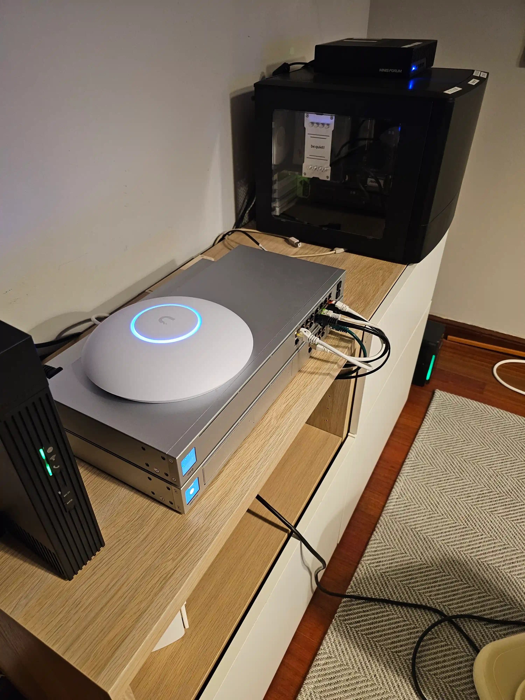
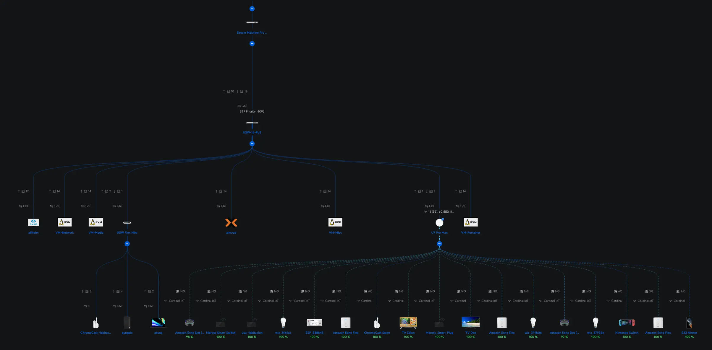
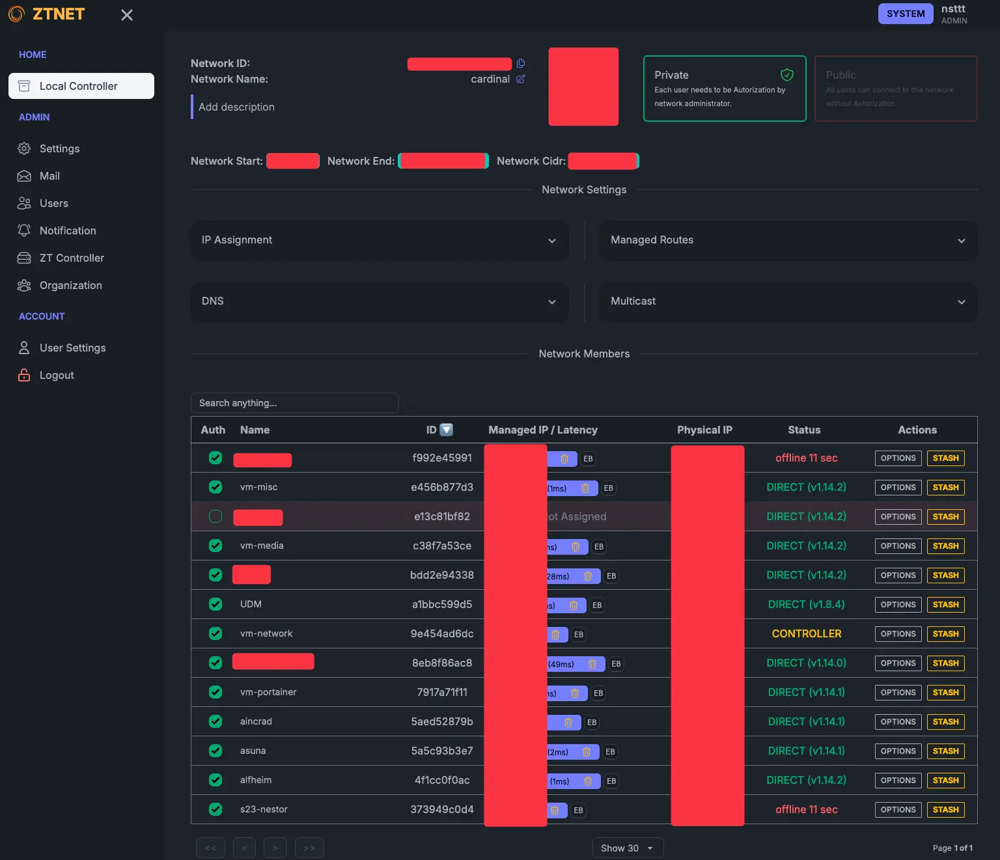
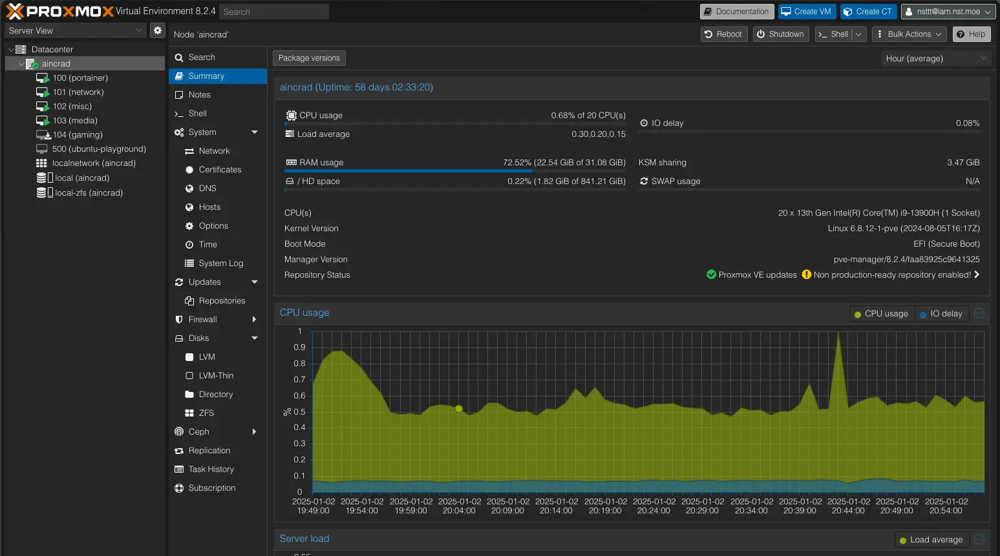

Welcome to the first post in what I’m calling my **_“Planetary Datacenter”_** series. Essentially, I’ve got a **homelab** that I’ve been tinkering with for a while, **building**, **refining**, and sometimes _breaking it (on purpose!)_ to learn how to make it better. Now, I’m ready to share everything I’ve learned so far.

I jokingly refer to my setup as a **_“Planetary Datacenter”_** because it stretches beyond just my house. Thanks to _clever networking_ and tools like [**ZeroTier**](https://docs.zerotier.com/), I can place services just about anywhere on the globe (hence **_“planetary”_**) and still have them communicate as if they were right next to each other on my local LAN. If you’re into homelabs, networking, or just curious about how to structure your own multi-machine environment, _stick around_.

I’ll walk you through all of it.

## What is the _“Planetary Datacenter”_ anyway?

I first introduced this idea at a **CNCF Galicia** talk, where I discussed how I use [**ZeroTier**](https://docs.zerotier.com/) and [**WireGuard**](https://www.wireguard.com/) to interconnect various machines. Over time, I realized that combining ZeroTier with my local hardware gave me a pretty powerful setup: everything in one _“big” virtual LAN_, accessible anywhere.

So, if you picture your typical data center with racks and servers, now shrink it down to something you can manage in your living room or home office, then _magically_ extend it worldwide. That’s basically the idea.

### Why bother with something this complex?

- **Learning & Fun:** I love _experimenting_. Homelabs are a great way to learn networking, virtualization, and new software.

- **Centralizing Services:** With this setup, I can keep my personal data and services under _my_ control, especially stuff like media servers, backups, and specialized containers.

- **Planet-Wide Access:** I can spin up a new service on a VPS, at home, or in a cloud provider. As soon as I hook it up to my [**ZeroTier**](https://docs.zerotier.com/) network, it feels like it’s right there on my LAN. And in a worst case scenario, migrating can be done with a _click of a button_.

## Physical Infrastructure at Home

I’ll start by breaking down the hardware so you know what I’m working with.

### ISP Router & Ubiquiti hardware

My ISP router is basically acting as a **pass-through device**. I’ve set it up with DMZ mode pointing straight to my [**_UDM Pro Max_**](https://ui.com/). The UDM is the _nerve center_ of my home network. It handles VLANs, firewall rules, and all the fancy Unifi-based management. If you’re familiar with the Unifi ecosystem, you know it’s pretty user-friendly yet powerful enough to do some advanced stuff if you know how to hack it enough.

### Switches & Access Points

- **USW 16 PoE Switch**: Handles both power (PoE) for devices like Wi-Fi access points and general switching duties.

- **U7 Pro AP**: My main Wi-Fi access point.

- **USW Mini**: A _tiny_ switch I use for some client machines (like my Mac and a Windows machine).

### Main Machines

1. **NAS [TrueNAS Scale](https://www.truenas.com/truenas-scale/)**

   - **CPU/RAM**: Intel i5-7600K, 16GB RAM

   - **Storage**: 1×1TB SSD for the OS + 4×16TB HDD in a ZFS _“striped mirrors”_ arrangement.

   - **Role**: Holds all my data, shared mainly over [_NFSv4.2_](https://www.rfc-editor.org/rfc/rfc7862.htmll).

2. **MS01 [Proxmox Server](https://www.proxmox.com)**

   - **CPU/RAM**: Intel i9-13900H, 32GB RAM

   - **Storage**: 2×1TB NVME in _RAID1_

   - **Special Trick**: I fitted it with a _modified Intel ARC A380 GPU_ for hardware transcoding (swapped in a smaller heatsink from an ARC A310).

   - **Role**: Runs **Proxmox**, which hosts multiple VMs for all sorts of services (media, networking, Portainer, etc.).

## VLANs & Wi-Fi Networks

**VLANs** (or _Virtual LANs_) let me split up my network into smaller segments, keeping different types of traffic isolated from each other. Here’s what I have:

1. **LAN**: The _default network_ for my local machines and most VMs.

2. **Guests**: For visitors, restricted access, minimal privileges.

3. **IoT** & **IoT Private**:

   - _IoT_: For general smart bulbs, plugs, and devices that _do_ need internet access.

   - _IoT Private_: For devices that are strictly local (no external communication needed).

4. **Surveillance**: Dedicated for _cameras_. They don’t need broad network access or the internet, so this VLAN keeps them isolated.

5. **Services** & **DMZ**: These VLANs exist in the UDM Pro config but are primarily used in conjunction with **ZeroTier**.

### Wi-Fi Networks

1. **Cardinal** (Main Wi-Fi): Tied to my LAN VLAN.

2. **Cardinal Guest**: Segregated, on the Guest VLAN.

3. **Cardinal IoT**: A 2.4GHz-only SSID for IoT devices. It uses _pre-shared keys_ for network segregation based on SSID password.

   - **Cardinal IoT**: For IoT devices that uses the internet somehow.

   - **Cardinal IoT Private**: For local-only IoT devices with no internet access.

   - **Cardinal Surveillance**: For camera devices, same concept as the private one but as a separate VLAN.

### The Role of ZeroTier

I create two VLANs in **ZeroTier**, **VLAN 2** (Services) and **VLAN 3** (DMZ), then I bridge them back into my local Services and DMZ VLANs on the **UDM Pro**.

This bridging is done via some _custom scripts_ and the UDM’s “persistence” system. Because ZeroTier operates at **Layer 2**, it's not just simple routing, it's effectively replicating the broadcast domain. It might be a bit of a hack, but it allows ZeroTier traffic to flow in and out of my local VLANs as if they were physically plugged in.

Additionally, ZeroTier includes a powerful rules engine. This allows me to define custom firewall-like policies, such as disallowing certain VLAN-tagged traffic, restricting specific ports, or enforcing IP-based rules, directly within the ZeroTier network. That means I can shape traffic based on my exact security needs while still giving devices full Layer 2 connectivity when appropriate.

## Why ZeroTier Is at the Core

**ZeroTier** basically gives me an _encrypted overlay network_ that all my devices, home-based, in the cloud, or in someone else’s data center can connect to. It creates a _“planetary virtual switch,”_ letting me hand out IP addresses on VLAN 2 (for general services) or VLAN 3 (for internet-exposed services).

For example, if I spin up a VPS in some random location, I just install the **ZeroTier** client, join my ZeroTier network, and give it an IP in VLAN 2 or VLAN 3 and **boom**, it’s as if it’s plugged into my home switch. That’s the _“planetary”_ part!

I self-host the **ZeroTier controller** instead of relying on the official ZeroTier infrastructure. Since ZeroTier is open-source, I can run my own controller node on my **Network VM**.

To make management easy, I use a _community-built UI_ that gives me a web dashboard for seeing which devices are connected, assigning IP addresses, and approving or denying new join requests. It’s _containerized_ using a _Docker MacVLAN_ trick we will talk later about, so it’s directly available on VLAN 2 without any weird network hoops.

This approach also ensures I’m in _full control_ of my environment: if the official ZeroTier services ever go down, I’m still good to go, and I can customize every aspect of my network as I see fit.

## TrueNAS & Proxmox

### TrueNAS Scale

On my **NAS**, I’m not using many of TrueNAS’s built-in virtualization features. Instead, it’s mostly:

- **Storage**: A few major datasets.

- **Network**: I install **ZeroTier** directly on TrueNAS to ensure it can talk to other machines over the overlay network.

- **Performance**: The 1TB SSD is for the OS, and the 4×16TB EXOS drives are in _ZFS striped mirrors_. This gives a nice balance of capacity, speed, and redundancy.

I also have a direct **SFP+** connection between my NAS and the Proxmox server (**MS01**) for faster data transfers. That means all my VMs can access _NFS_ shares at _10GbE speeds_, which is super handy for big data or media workflows.

#### Why NFSv4.2?

I’m using **NFSv4.2** mainly because it builds on earlier versions while adding a bunch of super handy extras. Here’s a quick rundown:

- **NFSv3** has been around forever and is rock-solid, but it doesn’t include modern security or integrated locking (it relies on separate protocols like NLM).
- **NFSv4** unified the protocol, locking, and security into one standard, making life easier and reducing extra sideband protocols.
- **NFSv4.1** introduced **Parallel NFS (pNFS)**, which lets you read and write data in parallel across multiple servers for better performance when you need to scale out.
- **NFSv4.2** takes it all a step further with features like **server-side copy**, improved sparse file handling, and extended attributes. This makes it especially handy for virtualization and container workloads where you need faster data movement without pounding your network.

Basically, **NFSv4.2** gives me a modern, flexible, and efficient setup, perfect for my homelab needs.

### Proxmox Server Node (MS01)

This is my “big” server with an **i9-13900H** and **32GB of RAM**. I also popped in a _custom Intel ARC A380 GPU_ for hardware transcoding (like Jellyfin) because Intel excels at that. Here are some highlights:

- **Microcode Patches**: If you’re using a _new-gen_ Intel CPU, you might need microcode patches to avoid weird performance or stability issues. [Here's the Proxmox microcode script if you want to have a look at it](https://github.com/community-scripts/ProxmoxVE/blob/main/misc/microcode.sh).

- **GPU Passthrough**: [Proxmox](<https://pve.proxmox.com/wiki/PCI(e)_Passthrough>) makes it pretty straightforward. You just enable _Intel IOMMU_ in the grub config, load the vfio modules, and pass the GPU through to whichever VM needs it.

- **VMs**: I run four main VMs. Portainer, Network, Media, and Misc.

## VM setup

One of the **key pieces** of this setup is a _Docker MacVLAN interface_ approach that allows my containers to attach _directly_ to the ZeroTier VLAN interfaces.  
It keeps _host_ networking simpler and gives each container a dedicated IP isolated to the ZeroTier VLAN.

#### How it works

In Docker, I create a [**MacVLAN interface**](https://docs.docker.com/network/macvlan/) bound to the **ZeroTier interface**. That way, each container in that network appears on the ZeroTier VLAN with its own MAC address (and IP) instead of piggybacking on the host OS. This method isolates container traffic _cleanly_ from the VM’s main interface, which helps when bridging or routing across different VLANs.

### Portainer VM

- Runs on **Ubuntu 24** nothing fancy installed.

- Docker + [**Portainer**](https://docs.portainer.io/) so I can have a nice web UI for managing all my containers.

### Network VM

- Also **Ubuntu 24**, but here’s where I keep _network-related_ containers:

- [**ZTNET**](https://ztnet.network/) a cool community-built ZeroTier controller UI (**built with the T3 Stack!!**)

- [**Pi-hole**](https://pi-hole.net/) for my private DNS.

- [**Nginx Proxy Manager**](https://nginxproxymanager.com/) reverse proxy for my services.

- [**Authentik**](https://goauthentik.io/) my identity provider, or IdP.

### Media VM

- This is my _entertainment hub_. It has the full **\*Arr** suite. If you have no idea what that is, [take a look at the wiki.](https://wiki.servarr.com/)

- GPU passthrough is set up here, so **Jellyfin** can do hardware transcoding with the **Intel ARC** card.

- All config folders and downloads get mapped to the **NAS’s** NFS shares, so everything is in one _central spot_.

#### Hardlinks & NFS

I’m using **hardlinks** so that I can have a file appear in multiple places (like the _“downloads”_ folder and the final _“TV Shows”_ folder) without doubling the storage cost.

You just have to be consistent with your paths in **Docker Compose**, **NFS shares** and your **\*Arr apps**, so everything references the same _“root”_ mount point.

### Misc VM

- A catch-all for _small projects_ or services that aren’t big enough to warrant their own machine.

## GitOps and Docker Compose

I’m a huge fan of **Docker Compose** because it’s easy, fast, and reproducible. I keep a _Git repo_ with all my Compose files and volumes declared. If I ever blow away a VM or want to spin up a new environment, I just clone the repo and run **docker compose up**.

#### Why Portainer?

I like to pair this _Git-based workflow_ with [Portainer](https://www.portainer.io/) because it gives me a **simple, intuitive UI** on top of my Docker environment. While **Docker Compose** keeps everything _version-controlled_ and _scriptable_, **Portainer** ties it together with a **dashboard** that shows all my containers, volumes, networks, and logs in one place.

It even has built-in **GitOps-style features**, like pulling changes directly _every so often_ from your repo or using **webhooks**, so you can keep everything _updated automatically_. That means I don’t have to drop into the _CLI_ just to check container statuses or tweak settings. I can do it all from my **browser**.

If you know of any other tools that offer a **similar UI-driven approach** and integrate well with _GitOps_, [**let me know**](https://x.com/nstlopez)! I’m always on the lookout for **alternatives**.

#### Why not LXC?

While [**LXC**](https://linuxcontainers.org/) can be more lightweight and can potentially yield _better performance_, it’s just trickier to _replicate_ consistently. If you know a way to make **LXC** more _reproducible_, I’d love to hear it! Hit me up on [Twitter](https://x.com/nstlopez).

Also, hooking up **NFS** inside an LXC can get messy with permission issues and restricted container access.

With **Docker Compose**, I can easily _map volumes_ from my **NAS** (especially the config volumes) and keep the setup modular.

## Coming Up Next

This was just the _general overview_. In future posts, I’ll dive deeper into specifics like:

- **UDM Pro VLAN Bridging**: Exactly how I got ZeroTier VLAN 2 and VLAN 3 to mesh with the UDM and hacking the UDM’s persistence system.

- **GPU Passthrough Step-by-Step**: The commands and configurations I used in Proxmox.

- **Arr Services and Hardlink Magic**: A deeper guide on making \*Arr apps handle hardlinks smoothly.

- **Nginx Proxy Manager + Authentik**: How I secure external services while letting them stay easy to reach from anywhere.

- **ZeroTier**: More on how I set up ZeroTier.

- **GitOps**: How I manage my Docker Compose files and volumes with Git.

- **Monitoring & Alerts**: How I keep an eye on everything through **Grafana**, **Alloy**, and other tools.

## Wrapping Up

So, that’s the broad overview of my **_Planetary Datacenter_**, my homelab that thinks it can conquer the world (or at least my corner of it).

As I keep iterating on this setup, I’ll share everything I learn, _mistakes_, discoveries, and hopefully some _cool tips_. If you have any questions or want to suggest your own improvements, drop a comment (or tweet, or smoke signal, whichever you prefer). I’d love to hear how you’re tackling similar homelab challenges.

Stay tuned for more _detailed breakdowns_, and thanks for reading!
