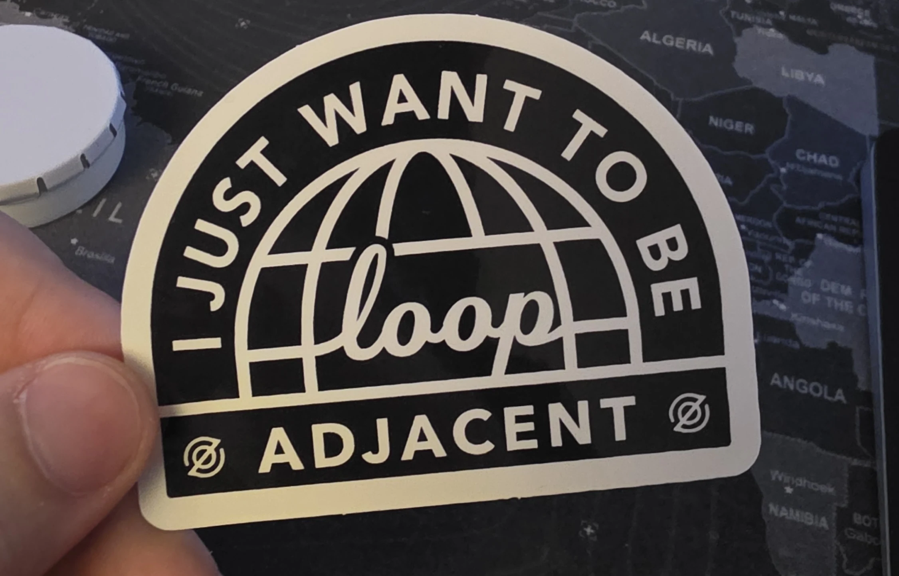

Ok, so. Here's the weird part: I think the next big software category might look like **less software**, not more.

The obvious story is "AI will make SaaS better." Sure, probably. But I don't think that's the interesting story.

The interesting story is that the **contract** is starting to change.

For the last twenty years, the playbook was clean: find a painful business workflow, wrap it in a dashboard, sell seats, add admin controls, add reporting, and call it a category. Salesforce did this for CRM. Zendesk did it for support. NetSuite did it for finance. The customer wasn't buying completed work. They were buying the **cockpit** for doing the work themselves.

`Service as a Software` flips that. The pitch is no longer "here's the interface, your team handles the rest." The pitch is closer to "send us the task, we'll send back the result."

That's not a feature change. That's a business model and trust boundary change.

SaaS sells **outputs**.

This new thing tries to sell **outcomes**.

## The Old Magic Was That the Human Was Still the Runtime

Classic SaaS was such a good business because the software improved the workflow without actually taking responsibility for the final step. It made people faster, more organized, more measurable, less error-prone. But the human operator was still the one closing the loop.

That detail mattered a lot.

It explains why seat-based pricing fit so naturally. More operators meant more value. More value meant more licenses. It was still, at heart, a **tool business**.

You can see this pretty much everywhere:

- the CRM creates and organizes the lead
- the support system tags and routes the ticket
- the finance product assembles the invoice

But the software stops one level short of the actual business promise. Someone still has to decide, approve, send, reconcile, follow up, or clean up the weird edge case from Thursday afternoon.

That's the part getting eaten.

## The Category Shift Is Not AI Features, It's Operational Ownership

This is where I think people flatten the whole thing into "AI SaaS", which is a bit too neat.

Adding a chatbot to the sidebar is not the shift. Autocomplete isn't the shift either. Even a very good copilot may not be the shift.

The shift happens when the software starts absorbing enough of the **operational loop** that the customer relates to it more like a service provider than a tool vendor.

Not "help my team do this."

More like "just get this done."

That's the center-of-gravity move.

An **output** is what the product produces: a record, a draft, a classification, a generated invoice.

An **outcome** is what the customer was actually trying to buy: the meeting got booked, the refund got processed, the ticket got resolved, the books got closed without drama.

SaaS made operators better at producing outputs.

Service as a Software tries to own enough of the path to the outcome that the customer stops thinking in clicks and starts thinking in completed work.

## What This Looks Like When You Zoom All the Way In

Take invoice processing.

In the SaaS version, the pitch is familiar: here is a cleaner queue for your AP team, better search, better approval flows, maybe some OCR so the PDFs stop being awful. Still useful. Still software. Still your team doing the job.

In the Service as a Software version, the promise gets much more specific:

- ingest the invoice from email or vendor portal
- extract line items and tax fields
- match it against the PO and vendor record
- push straight-through cases into the ERP
- route the suspicious 6% to a human with context attached
- keep an audit trail for every decision

Same workflow. Very different product.

The thing being sold is no longer "finance software." It's closer to "we help you close AP without staffing every step manually."

And once you frame it that way, a bunch of product decisions invert.

## The Interface Gets Demoted and the Invisible System Gets Promoted

In classic SaaS, the dashboard is the star. You demo the UI. You count active seats. You brag about time spent in product (well, maybe not publicly, but you know what I mean).

In this model, the ideal reaction is almost the opposite:

> nice, I barely had to open it

That's a very different success condition.

The visible app gets thinner. The invisible machinery gets much more important:

- orchestration
- retries
- confidence thresholds
- escalation paths
- audit logs
- human review queues
- fallback logic for when the model gets weird

Because the work is the product now, not the screen.

## The Real Moat Is Not the Answer, It's Owning the Miss

This is the part I keep coming back to.

The hard part is not generating something plausible. Models are increasingly good at that. The hard part is being **on the hook** when the result is wrong.

A normal SaaS vendor can still say, in effect, "we provide the controls; your team decides what to do." A Service as a Software company has to say something much scarier:

> yes, we'll do the work
>
> and yes, we own what happens when it goes sideways

That's why I don't think the moat here is "we have access to model X."

The moat is everything around the model:

- confidence calibration
- exception routing
- rollback and replay
- compliance posture
- auditability
- good human handoff when automation should stop pretending

In other words: operational taste, turned into software.

That's the asset.

## If You Want to Build This, Usage Metrics Stop Being the Main Story

This also changes how these companies should probably be measured.

If your product is still basically software, you care about seats, time in app, feature adoption, expansion by team, all the usual stuff.

If your product is drifting toward service, the better questions start sounding more operational:

- what percentage goes straight through without human touch?
- where do failures cluster?
- how quickly do exceptions get resolved?
- how legible is the audit trail?
- can a customer trust the handoff when the system says "I don't know"?

That's why this category feels so awkward to people looking at it through a pure SaaS lens. The product metrics start blending into service metrics. The app becomes part software, part operations console, part policy engine, part accountability surface.

Messy category. Real shift.

## Software as a Service Was an Abstraction Win; This Is the Next One

`Software as a Service` took us from installing boxed software to renting capabilities over the network. Huge abstraction win. One of the best business-model upgrades the industry ever got.

`Service as a Software` feels like the next step. Not because dashboards are dead. They aren't. And not because every workflow should be fully automated. Absolutely not.

But because more buyers are going to ask a much simpler question:

Do I want another tool for my team?

Or do I want this problem mostly gone?

That seems like the real shift.

The companies that matter in the next wave won't just build nicer admin panels with better AI affordances. They'll build systems that quietly eat repetitive service businesses from the inside, one workflow at a time.

I don't think we fully have the language for this category yet.

But I think this is the layer that matters.
